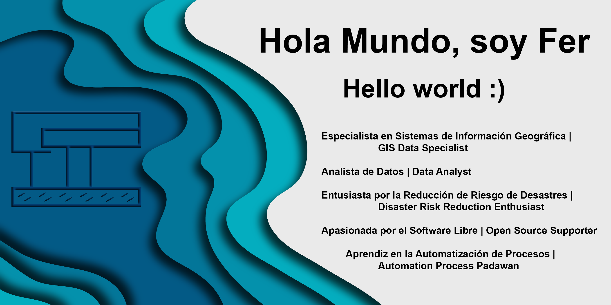

- 👋 Hola a todos, mi nombre es Fernanda, es un gusto conocerlos.
-  ❤️ Soy fiel creyente de que los datos organizados son la clave para cualquier trabajo, pero si estos no están bien analizados y cotejados, cualquier proyecto está destinado al caos. Así que me he dedicado a fomentar las buenas prácticas en el análisis de datos, en especial a los georeferenciados, ya que nos permiten detectar patrones espacio-temporales, que facilitan la toma de decisiones, algo vital en la Gestión Integral de Riesgos.
- 🌱 Actualmente estoy mejorando mis habilidades en Python y R, por lo que mis repositorios serán sobre esos programas, son bienvenidos en hacer sugerencias, qué mejor que formar una comunidad.
Además, manejo software como QGis, ArcGis, la siempre confiable paquetería de Office, la paquetería de Google, ¿y ya había mencionado Python y R? 😁
- 🖥️ Estoy buscando trabajar en empresas que fomenten el uso de herramientas tecnológicas para mejorar la toma de decisiones y optimizar los procesos de análisis de datos.
- 📫 Cómo localizarme: visita mi perfil de LinkedIn www.linkedin.com/in/fernanda-rojas-190914, me dará gusto saber de ti.
- ⚡ Fun fact: Podría ver todas las películas del Señor de los Anillos y jamás aburrirme, exacto, las seis películas y hasta en versión extendida 🤓🎥🍿

